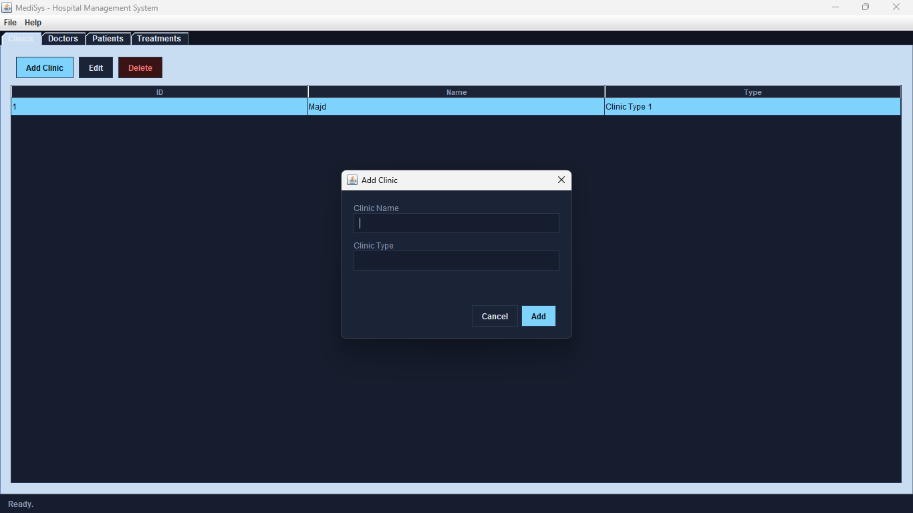
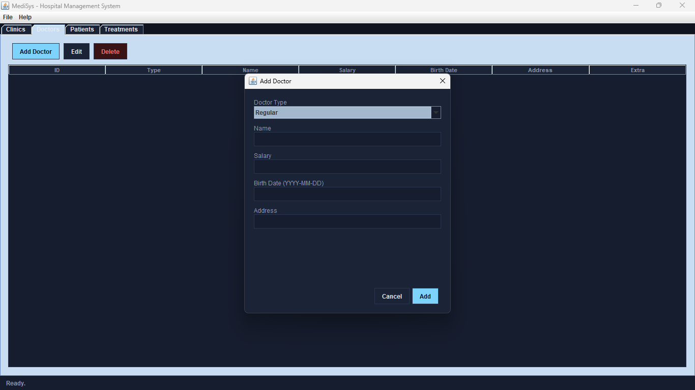
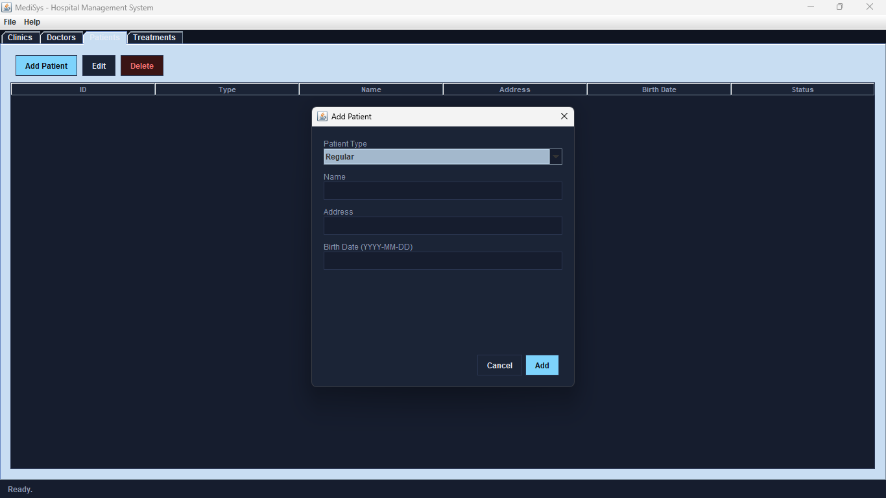
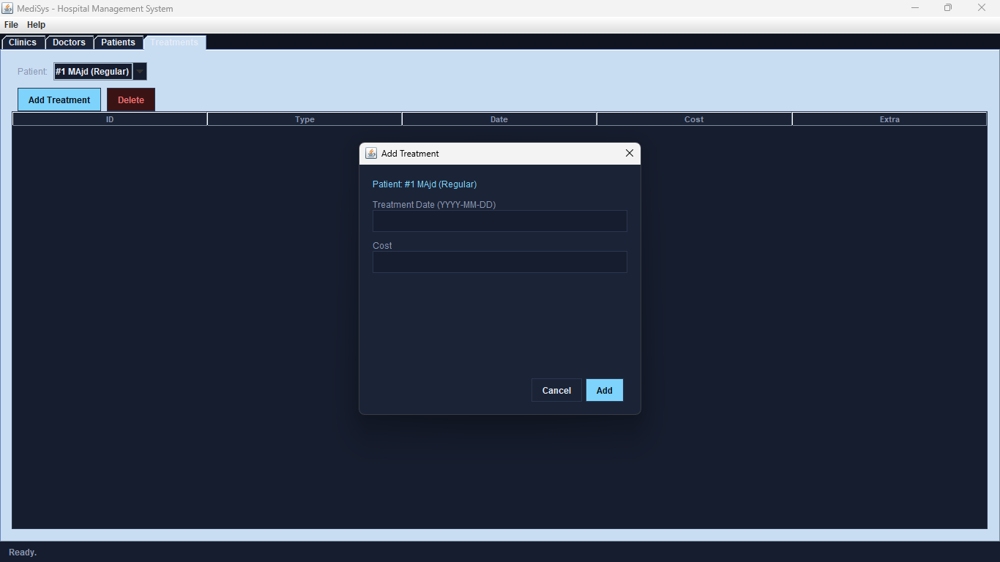

# دليل الواجهات

[⬅ توثيق النسخة](README.ar.md) · [English](UI_GUIDE.md)

جولة على نوافذ **الإضافة** الأربعة — وحدة لكل تاب — بلقطات شاشة حقيقية. كل نافذة بتتبع نفس الشكل: فورم، سطر خطأ داخلي بيظهر بس عند إدخال غلط، وأزرار Cancel / Add. شوف [`DOMAIN.ar.md`](DOMAIN.ar.md) لكل قواعد الحقول بالتفصيل وراء كل وحدة منهم.

## تاب Clinics — Add Clinic

أبسط نافذة: بس اسم ونوع نصي حر. ما في قائمة منسدلة هون لأنه العيادات ما إلها أنواع فرعية — كل عيادة بنفس الشكل، وبس شريط أدوات CRUD العادي (Add / Edit / Delete) منطبق عليها.

ضيف عيادة **قبل** ما تضيف علاج خارجي (External) بعدين — قائمة العيادات بتاب Treatments مبنية من أي عيادات موجودة أصلاً، فقائمة عيادات فاضية معناها المرضى الخارجيين ما فيهم ياخدوا علاج لسا (`TreatmentDialog` بترجع *"Add a clinic first."* إذا جرّبت).

## تاب Doctors — Add Doctor

**Doctor Type** هي يلي بتحدد أي حقول إضافية بتظهر تحت الحقول المشتركة Name / Salary / Birth Date / Address — النافذة بتبدّل بطاقة (card) بمكانها بدل ما توري كل الحقول لكل الأنواع مرة وحدة:

| نوع الطبيب | الحقل/الحقول الإضافية |
|---|---|
| Regular | *(ولا شي — بس الحقول المشتركة)* |
| Contracted | Contract Date |
| Trainer | Start Date، End Date |
| Inner | Department Number |

كل التواريخ بصيغة `YYYY-MM-DD` ومتحقق منها عند الإرسال؛ تاريخ غلط أو راتب غير رقمي بيطلّع خطأ داخلي بدل ما يسكّر النافذة. لما تفتح نفس النافذة عشان **تعدّل** طبيب موجود، **Doctor Type** بتنعطّل — فيك تغيّر قيمة أي حقل، بس مش النوع الفرعي للطبيب، مطابقةً لكيف نظام الأنواع بجافا بيشتغل فعلياً (شوف [`DOMAIN.ar.md`](DOMAIN.ar.md#إضافات-خاصة-بالواجهة-الرسومية)).

## تاب Patients — Add Patient

نفس نمط الأطباء: **Patient Type** بتختار أي حقول إضافية بتظهر، بس هالمرة بس ثلاث خيارات بدل أربعة:

| نوع المريض | الحقل/الحقول الإضافية |
|---|---|
| Regular | *(ولا شي — بس الحقول المشتركة)* |
| External | Acceptance، Accept Date |
| Internal | Discharge، Discharge Date |

نوع المريض هو يلي تاب Treatments بيستخدمه عشان يقرر أي نوع نافذة علاج يوري بعدين — شوف تحت.

## تاب Treatments — Add Treatment

هاي النافذة هي المكان الوحيد يلي التطبيق بيوصل فيه لبرا التاب الحالي: بتقرا **نوع المريض المحدد حالياً** من بيانات Patients وبتوري حقول مختلفة حسبها، بدون أي قائمة نوع خاصة فيها:

المريض بهاي الصورة — **#1 MAjd (Regular)** — هو `Patient` عادي، فالنافذة بتوري بس الحقلين يلي كل علاج محتاجهم: **Treatment Date** و**Cost**. للنوعين التانيين من المرضى، النافذة بتضيف حقول مختلفة بدل هالحقلين الإضافيين:

| نوع المريض | الحقل/الحقول الإضافية | صنف العلاج المُنشأ |
|---|---|---|
| Regular | *(ولا شي)* | `Treatment` |
| Internal | Department ID | `InternalTreatment` |
| External | Doctor (قائمة منسدلة)، Clinic (قائمة منسدلة) | `ExternalTreatment` |

قائمتَي Doctor وClinic معبّيتين من أي أطباء/عيادات موجودين أصلاً بالمستشفى — إذا أي وحدة من القائمتين فاضية، الإرسال لمريض External بيرجّع *"Add a doctor first."* أو *"Add a clinic first."* بدل ما ينشئ علاج مكسور. هاد كمان سبب إنه يستاهل تضيف أطباء وعيادات قبل العلاجات الخارجية، متل ما مذكور بـ [توثيق النسخة](README.ar.md#استخدام-التطبيق).

## سلوك مشترك بين النوافذ الأربعة كلهم

- **تحقق داخلي (Inline validation)** — كل حقل مطلوب، حقل رقمي، وحقل تاريخ بينفحص قبل ما النافذة تسكّر؛ أول مشكلة بتنلقى بتظهر كسطر أحمر فوق الأزرار بدل نافذة منبثقة، والنافذة بتضل مفتوحة عشان تصلّحها.
- **Cancel مقابل زر إغلاق النافذة (×)** — الاثنان بيتجاهلوا النافذة بدون ما يغيروا أي بيانات؛ ولا شي بينكتب لحد ما تضغط **Add** (أو **Save**، وقت التعديل) والتحقق ينجح.
- **Add وEdit نفس صنف النافذة** — فتح وحدة من هاي النوافذ على صف موجود بيعبّي كل حقل مسبقاً من هداك السجل وبيغيّر تسمية الزر لـ **Save**؛ قائمة Doctor/Patient Type بتنعطّل بهاي الحالة تحديداً (شوف قسم الأطباء فوق) لأنه تغيير النوع الفرعي الفعلي لكيان موجود مش شي نموذج البيانات بيدعمه بمكانه.
